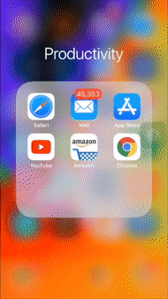

    

 

## About

Built for fun and 
Available on [Expo](https://expo.io/@cameronyking/devils-cup) for testing @ https://expo.io/@cameronyking/devils-cup

    
	
	

## Demo on Smartphone

To play the game follow these three easy steps: 
1. Download "Expo Client" in your App Store
2. Login with the creditials -
	username: kyng 
	password: kyng 
3. Open "devils-cup" in "Published Projects"

## Open Source

Made with React Native, I've made it open-sourced:
1. Download the project
2. Download Explo CLI 
3. Make sure NPM is install globally
4. Run "npm install" 
5. Run "npm start"

Enjoy :)

## License

MIT

    